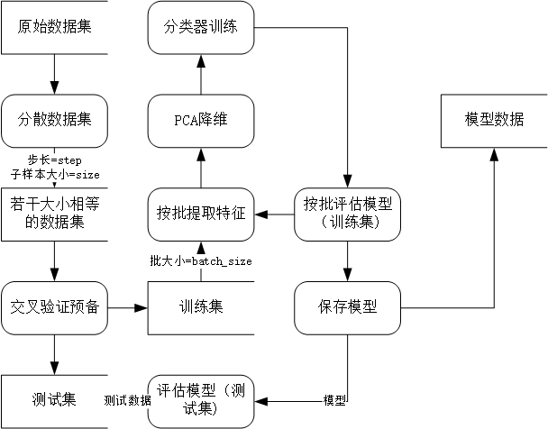

# Action Recognition With Skeleton 
> Sexy model using online learning

Action recognition with skeleton data of CAD-50 dataset.

## Principle
The specific process are as follow.



## Principle
具体流程如下图：


The first step is scatter the dataset 
which for the different number of images within 
each class.
The significance of `step` and `size` is to 
sample every `step` frame once and sample 
the number of `size` frames once. 

The idea of incremental training (online learning) is 
adopted to extract features in batches, and a large 
number of data are extracted in batches, 
then train the classifier.

## Usage example
Put the original data file (txt file) into 
`data/original'before everything starts, 
and use the following command: 
```sh
python data_preprocessing.py
```
If you want to train the model, use the `input-dir` 
parameter to specify the address of the data set and 
determine that the folder exists.
```sh
python main.py --input-dir data/input
```
If you want to load the model, use the `load-model` 
parameter and place `naive_bayes.pkl` in the `model` 
folder.  
```sh
python main.py --input-dir data/input --load-model
```
If you would like incremental training, use `--partial-fit`
additionally.
```sh
python main.py --input-dir data/input --load-model --partial-fit
```

## Development setup

Make sure sklearn、numpy、scipy installed completedly。
```sh
pip install sklearn
pip install numpy
pip install scipy
```

# 使用骨架数据进行动作识别
> 性感模型，在线学习  

使用CAD-60中的骨架关节点数据进行动作识别，
## 原理

第一步分散数据集，是因为每个类内图像数量不同，
为实现每个样本大小不同。此处步长和子样本大小的意义是指
每`step`帧进行一次采样，一次采样`size`数量的帧。

按批提取特征采用增量训练的思路（在线学习），
将大量的数据按批进行提取特征，随后进行分类器训练。

分类器选用的是朴素贝叶斯分类器。
## 使用方法
在一切开始之前将原始数据文件（txt文件）放入`data/original`，
并使用如下命令：
```sh
python data_preprocessing.py
```
如果你想训练模型，使用`--input-dir`参数指定数据集所在地址，
并确定该文件夹存在。  
```sh
python main.py --input-dir data/input
```
如果你想加载模型，使用`--load-model`参数，
并将naive_bayes.pkl放在`model`文件夹中。  
```sh
python main.py --input-dir data/input --load-model
```
如果想使用增量训练（在线学习），加上`--partial-fit`参数。
```sh
python main.py --input-dir data/input --load-model --partial-fit
```

## 开发环境

确保sklearn、numpy、scipy这三个模块安装好。
```sh
pip install sklearn
pip install numpy
pip install scipy
```


